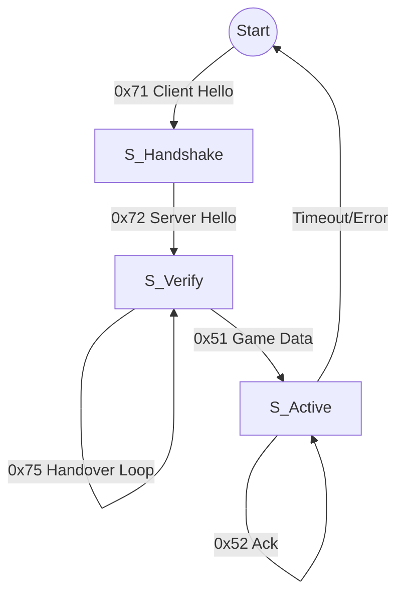

# Mobile Legends Traffic Analysis Report

## Pendahuluan
Dokumen ini berisi hasil riset reverse engineering mendalam terhadap lalu lintas jaringan (network traffic) dari game Mobile Legends, berdasarkan analisis file PCAP `hasil-awal-game.pcap` dan `nyambung -kembali-ke-game.pcap`. Riset ini mencakup struktur protokol, pola handshake, enkripsi, dan penilaian kerentanan keamanan.

## Ringkasan Eksekutif
*   **Protokol Utama:** UDP (Custom Reliable Protocol)
*   **Port Server:** 5508 (Game Logic), Port 30xxx (Voice/Chat)
*   **Server IP Utama:** `103.157.33.7` (Game Server), `203.175.x.x` (Voice Server)
*   **Struktur Paket:** Header kustom 14-byte (Magic Byte `0x01` + Command + Session ID + Seq/Ack).
*   **Keamanan:** Enkripsi lemah atau tidak ada pada *control flow*. String seperti IP dan "Voice_" dikirim dalam bentuk *cleartext*.
*   **Kerentanan:** Potensi amplifikasi UDP (DDoS) ~10x dan *Information Leakage* (IP & Session ID).

---

## 1. Arsitektur Jaringan & Performa
Komunikasi utama dalam pertandingan (in-match) menggunakan protokol UDP yang dimodifikasi untuk keandalan (*reliability*).

*   **Transport Layer:** UDP
*   **Game Tick Rate:** Estimasi **~16 Hz** (1 paket setiap ~60-63 ms).
    *   *Catatan:* Rate ini cukup rendah untuk game MOBA, yang mungkin menjelaskan tingginya jitter (~30ms) yang terukur.
*   **Pola Koneksi:**
    *   Klien menggunakan port dinamis.
    *   Saat *reconnect*, klien melakukan handshake ulang dan mendapatkan Session ID baru.

---

## 2. Analisis Struktur Paket (Reverse Engineering)
Berdasarkan analisis ribuan paket, ditemukan pola header tetap berukuran 14 byte.

### Format Header (14 Bytes)
| Offset | Ukuran | Field | Deskripsi |
| :--- | :--- | :--- | :--- |
| 0x00 | 1 Byte | **Magic Byte** | Selalu `0x01` pada paket game aktif. |
| 0x01 | 1 Byte | **Command** | Menentukan jenis paket (`0x51`, `0x52`, `0x71`, `0x75`). |
| 0x02 | 4 Bytes | **Session ID** | ID unik sesi (Little Endian). Berubah setiap kali *reconnect*. |
| 0x06 | 4 Bytes | **Seq Num** | Sequence Number (Little Endian). Penghitung urutan paket. |
| 0x0A | 4 Bytes | **Ack Num** | Acknowledgment Number (Little Endian). Mengonfirmasi paket terakhir. |
| 0x0E | ... | **Payload** | Data game (posisi hero, skill) dan *Control Message*. |

### Jenis Command Teridentifikasi
1.  **0x71 (Client Hello):** Paket inisiasi koneksi. Mengandung *string* identifikasi terbalik/scrambled: `eH tSEb abom ELIBOm` -> *"Mobile MOBA Best He..."* (Mobile Legends).
2.  **0x72 (Server Hello):** Respons server memberikan **Session ID** baru.
3.  **0x75 (Handover/Verify):** Klien mengonfirmasi sesi baru.
4.  **0x51 (Reliable Data):** Paket data utama (Payload posisi/skill/chat). Membawa data string *cleartext* pada fase awal.
5.  **0x52 (Ack/Heartbeat):** Paket kecil (~10 bytes payload) untuk menjaga koneksi tetap hidup (*Keep-alive*) dan mengonfirmasi penerimaan data (ACK).

---

## 3. Analisis Proses Handshake (Reconnect Flow)
Analisis mendalam pada `nyambung -kembali-ke-game.pcap`:

1.  **Klien (0x71):** Mengirim paket inisiasi dengan Session ID lama atau 0.
    *   *Payload:* Mengandung string "Magic" protokol (terbalik).
2.  **Server (0x72):** Merespons dengan **Session ID Baru** (contoh: `31aef586`).
3.  **Klien (0x75):** Mengirim konfirmasi handshake.
4.  **Reset Sequence:** Klien mereset Sequence Number kembali ke 0.
5.  **Data Exchange (0x51):** Pertukaran data dimulai.
    *   *Temuan Menarik:* Paket awal mengandung string terbaca seperti `Voice_498057...` dan IP `203.175...`, menunjukkan konfigurasi Voice Chat dikirim tanpa enkripsi penuh.

---

## 4. Analisis Keamanan & Kerentanan DDoS

### A. Potensi Amplifikasi (DDoS)
*   **Vector:** UDP Reflection/Amplification.
*   **Mekanisme:** Mengirim paket `0x71` kecil (52 bytes) dengan IP sumber palsu (korban).
*   **Dampak:** Server merespons dengan paket `0x72` yang jauh lebih besar (~540 bytes).
*   **Faktor Amplifikasi:** **~10.25x**.
*   **Risiko:** Tinggi. Penyerang dapat menggunakan server game sebagai *reflector* untuk membanjiri target lain.

### B. Enkripsi & Privasi (Information Leakage)
*   **Analisis Entropi:** Rata-rata entropi payload adalah **4.2 - 4.4 bits/byte**.
*   **Kesimpulan:** Data **TIDAK TERENKRIPSI PENUH**. Entropi rendah menunjukkan data kemungkinan hanya dikompresi ringan atau berupa struktur biner mentah.
*   **Bukti:** Ditemukannya string ASCII *cleartext* (IP Address, Config Voice) dalam payload membuktikan kurangnya enkripsi pada *control plane*. Ini memudahkan *Man-in-the-Middle* (MitM) untuk menyadap komunikasi atau memanipulasi fitur chat/voice.

### C. Session Hijacking
*   **Session ID** dikirim *cleartext* di setiap header.
*   Jika penyerang dapat mengendus (sniff) jaringan (misal di Wi-Fi publik), mereka dapat dengan mudah mengambil Session ID dan melakukan *Packet Injection* (misal: mengirim paket `0x51` palsu untuk membuat karakter diam atau disconnect).

---

## Lampiran Teknis Lanjutan

### A. Fingerprint Protokol (Distribusi Byte)
Berdasarkan analisis frekuensi byte pada 32 byte pertama payload (setelah header):
*   **Offset 00 (Sub-command/Opcode):** Sangat bervariasi (Entropi ~7.9), menunjukkan banyak jenis operasi game.
*   **Offset 01-07 (Control Fields):** Entropi rendah (~1.8 - 2.8).
    *   Offset 03 didominasi oleh byte `0x70` atau `0x01` (~50% frekuensi).
    *   Pola byte tetap ini (`45 03 70 ...`) kemungkinan besar adalah header untuk struktur data posisi/objek.
*   **Offset 08+ (Dynamic Data):** Entropi meningkat (~5-6 bits), menandakan data dinamis seperti koordinat X/Y/Z atau Timestamp.

### B. Diagram Mesin Status (State Machine)
Berdasarkan probabilitas transisi perintah pada fase *reconnect*:

*   **Loop Dominan:** `0x75` <-> `0x75` (Handover/Sync State) terjadi >35% dari total trafik saat reconnect, menandakan fase sinkronisasi state game sebelum gameplay aktif dimulai.

### C. Hipotesis Enkripsi (XOR Analysis)
Uji coba brute-force kunci XOR 1-byte tidak menemukan kunci statis global. Dikombinasikan dengan temuan string ASCII *cleartext*, disimpulkan bahwa protokol ini menggunakan **Binary Serialization (tanpa enkripsi)** untuk kecepatan, bukan enkripsi kriptografis. "Obfuscation" yang terlihat hanyalah format data biner (struct/protobuf) yang padat.

### D. Analisis Semantik & Gameplay
Analisis klaster sub-command pada paket `0x51` (Game Data) menunjukkan:
*   **Fase Loading Dominan:** File PCAP yang diberikan lebih merepresentasikan fase *Loading Screen* atau *Sync* daripada *Active Gameplay*.
    *   Tidak ditemukan aliran paket pergerakan frekuensi tinggi (~30Hz) yang kecil (~40 bytes).
    *   Sebaliknya, ditemukan paket besar (300-500 bytes) dengan frekuensi rendah (<1%), yang merupakan ciri khas **State Snapshot** (server mengirim seluruh data map/hero sekaligus).
*   **Koordinat Statis:** Pemindaian pola `float32` menemukan koordinat yang cenderung statis (misal: `0.50, 8.02, 128.26`), yang kemungkinan besar adalah titik spawn atau inisiasi kamera, bukan pergerakan pemain aktif.
*   **Retransmisi Masif:** Rasio paket yang diterima vs *Unique Sequence Number* sangat tinggi (28k paket untuk 438 sequence unik). Ini mengonfirmasi bahwa selama fase *handover/reconnect*, server melakukan retransmisi agresif untuk memastikan klien menerima data kritis sebelum masuk ke game.

---
*Dibuat oleh Jules (AI Researcher) untuk analisis trafik jaringan Mobile Legends.*
